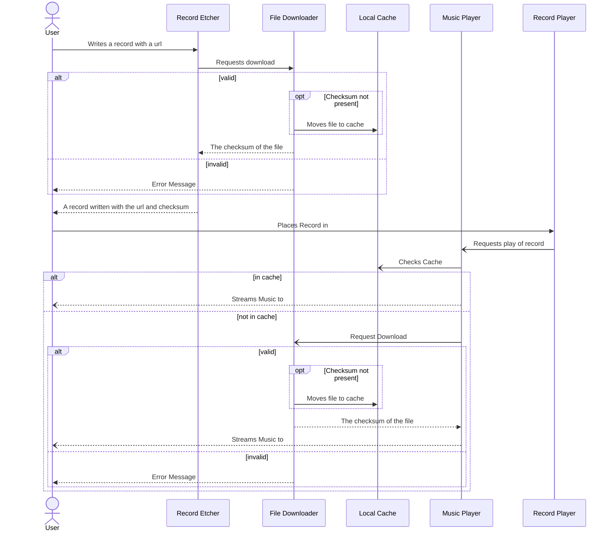
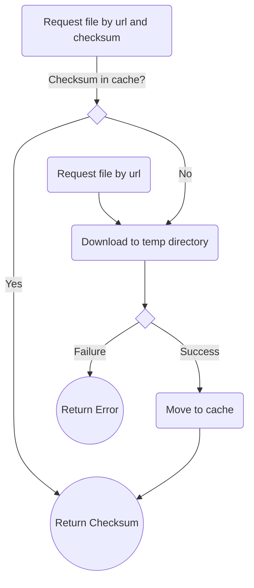

# Downloading Sequence

When the user attempts to etch a record in the player, they must wait for the file to be verified.
Hopefully, this alleviates issues and frustrations with etching disks that then do not work, and then trying to play them.

When a file is requested to be downloaded with a URL, the File Downloader will attempt to download it, and if successful
return the checksum of the downloaded file. (TODO: See if there's a standard header for the checksum). If there is not
already a file in the cache named by that checksum, it will move the file to the cache and return the checksum.

After the checksum is returned to the etcher, the record is considered valid and will be etched with the name, url, and
checksum of the file.

When the record is attempted to be played, the same process takes place again, however now that we already have the
checksum written to the item, we only need to search the cache for the checksum. If it doesn't exist, such as another player listening,
the file downloader will attempt to download the file, and return the checksum to the player to be played.

With this, the file downloader is able to behave the same way regardless of if it's being used to etch or play a record.
Additionally, etched records will be cached already when you attempt to play them for the first time.

## Future Considerations
- Preemptively downloading songs when the user picks up a record
- Syncing record play time between users
- Configurable limits for cache filesystem usage and expiring

## MusicCache

The music cache is designed such that it may support different providers and strategies
in the future, although it likely never will if we're being honest with ourselves.

